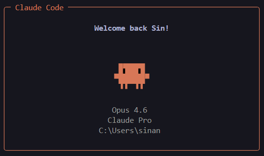
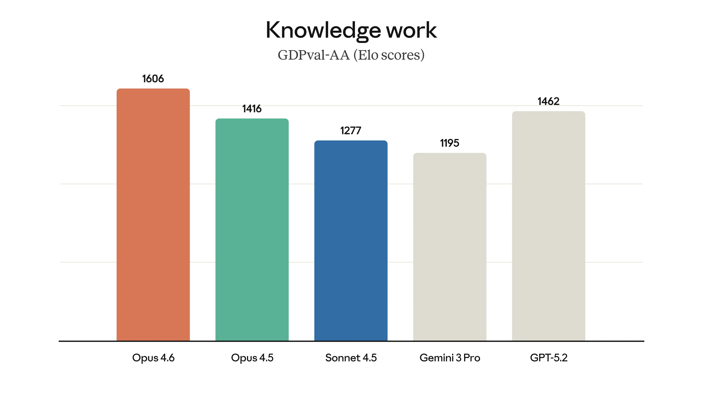
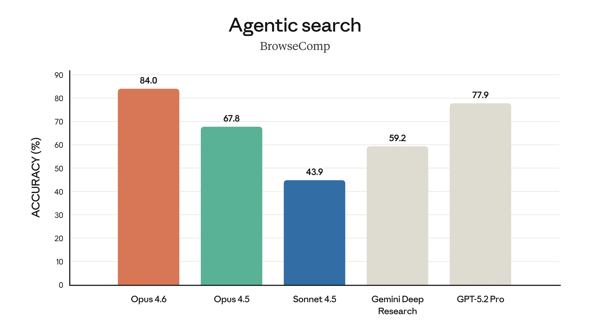
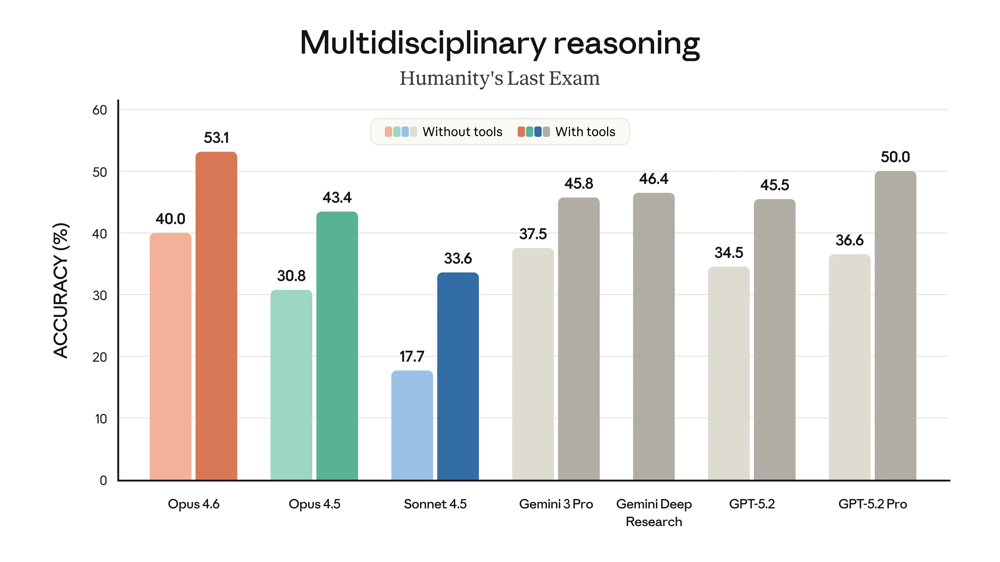
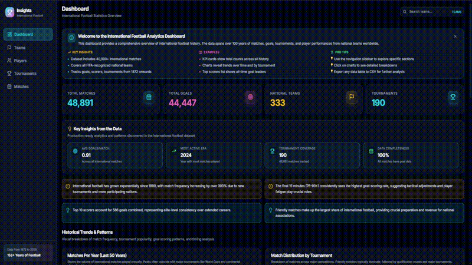

For years, turning raw sport data into something useful required either a dedicated data team or an expensive consultancy. Anthropic's newly released Claude Opus 4.6 model[^1], paired with Claude Code[^2], removes that constraint. Anyone can now build interactive dashboards and analytics workflows without writing code.

## The Resource Problem in Sport

The people closest to the data in sporting organisations (coaches, analysts, operations staff) often have strong domain knowledge but lack formal training in data science[^3]. They know what questions to ask, but turning those questions into dashboards or automated workflows requires technical skills. Research into data maturity across Australian sport found that organisations rated themselves just 5.6 out of 10, with significant gaps between aspiration and execution[^8].

Data analysts within these organisations are managing competing demands across departments, which limits how thoroughly and how quickly any single project can be delivered. Outsourcing is an option, but it is expensive, slow, and introduces data privacy risks.

## How Claude Code Enables Self-Service Analytics

Claude Code addresses this gap. Given a plain language instruction such as "create a dashboard that shows win rates by team across the last ten seasons", it writes the code, sets up the project, and delivers a working application. No programming knowledge is required. Tasks that currently take days in spreadsheets can be completed in minutes.

With Opus 4.6, the model powering Claude Code is significantly more capable at sustained reasoning and handling larger tasks. It makes fewer errors and produces higher quality output, meaning the analytics tools you can build are more ambitious and more reliable. Anthropic has also released Claude Cowork[^7], a companion tool for non-technical users who want to work with Claude outside of a coding environment.

### How Opus 4.6 Benchmarks Against Other Models

Benchmarks are standardised tests used to compare how well different AI models perform on specific tasks. Anthropic published results comparing Opus 4.6 against other leading models, including Google's Gemini 3 Pro and OpenAI's GPT-5.2.

**Agentic coding** measures a model's ability to autonomously write, execute, and debug code. This is the core capability powering Claude Code. Opus 4.6 leads at 65.4% on Terminal-Bench 2.0[^9] (a test simulating real coding tasks in a terminal), ahead of GPT-5.2 Codex CLI (64.7%) and Opus 4.5 (59.8%).

**Knowledge work** evaluates how well models handle real-world analytical tasks such as interpreting data, producing summaries, and generating reports. Opus 4.6 scores 1606 on GDPval-AA[^10] (a ranking system for everyday knowledge tasks), ahead of GPT-5.2 (1462) and Opus 4.5 (1416).

**Agentic search** tests a model's ability to find and synthesise information from multiple sources. Opus 4.6 achieves 84.0% on BrowseComp[^11] (a test requiring finding and combining information across the web), ahead of GPT-5.2 Pro (77.9%) and Opus 4.5 (67.8%).

**Multidisciplinary reasoning** assesses performance on complex problems spanning multiple fields. Opus 4.6 scores 53.1% with tools on Humanity's Last Exam[^12] (a test covering questions across dozens of academic disciplines), ahead of GPT-5.2 Pro (50.0%) and Gemini 3 Pro (45.8%).

The full benchmark comparison is shown below[^1].

## A Practical Example: 48,000 Football Matches in 40 Minutes

To put this into practice, I used Claude Code to build an interactive web application dashboard from a dataset of 48,000 football matches[^4]. The dashboard includes filtering, aggregation, visualisations, and the ability to explore match-level data across multiple dimensions.

The total cost was $15 AUD in API usage. The total time was 40 minutes.

Commissioning a similar dashboard from a data analyst or consultancy would typically cost thousands of dollars and take days or weeks. The barrier to entry was not programming skill. It was the ability to describe clearly what I wanted the dashboard to do.

**[View on GitHub](https://github.com/sinankprn/football)**

I also shared this project and my thoughts on building it in a [LinkedIn post](https://www.linkedin.com/posts/sinankprn_in-just-40-minutes-and-for-only-15-aud-activity-7414757732852879361-rs_h?utm_source=share&utm_medium=member_desktop&rcm=ACoAAFKBnPQBt_vKtEOnQl4t0mFckzsUL2UdNIw)

## What This Means for Sporting Organisations

1. **Performance analysis.** A performance analyst could take a season's worth of match data and build a dashboard that lets coaches filter by opponent, venue, or formation and see win rates, scoring patterns, and player workload at a glance.
2. **Community sport.** A state sporting organisation could take its registration data and build a tool showing participation trends by region, age group, and gender over time.
3. **Commercial and operations.** A commercial team could build an interactive tool that brings together membership, ticketing, and sponsorship data in one place.

## Limitations

There are three areas organisations should consider before adopting these tools.

### Technical requirements

Claude Code requires some comfort with the command line, though the learning curve is modest. The quality of output depends on how clearly you describe the task, so the ability to articulate what you want matters more than technical skill. For applications needing ongoing maintenance or integration with production systems, you will still need engineering support. As with any AI-generated output, results should be reviewed before being relied upon for decision-making.

### Data privacy

Before using Claude Code with real organisational data, you need to understand what happens to that data[^6]:

- **What is collected.** Your prompts, any data referenced in the session, and generated outputs are collected by Anthropic. If you include personal data, Anthropic will collect it.
- **Model training.** By default, Anthropic may use your inputs and outputs to train their models, unless you opt out. Content flagged for safety review may still be used.
- **Data storage.** Personal data may be transferred to and stored on servers in the United States, which is relevant for compliance with local data protection legislation.
- **Data retention.** Deleted conversations are removed from back-end storage within 30 days[^5]. If you have opted in to model improvement, data may be retained in a de-identified format for up to 5 years.

Start with anonymised or synthetic data and review Anthropic's policies against your own data governance requirements before using real organisational data.

### Claude for Work for organisational use

For organisations needing stronger data governance controls, Claude for Work[^13] (the Claude Team plan) offers a more appropriate path:

- **Data ownership.** Anthropic acts as a data processor rather than a data controller[^6]. The organisation retains control over its data.
- **No model training by default.** Inputs and outputs are not used to train Anthropic's models.
- **Team administration.** Organisations can manage user access, set permissions, and maintain oversight of how the tool is used across staff.

For a sporting body looking to move beyond individual experimentation, Claude for Work provides a more structured and privacy-appropriate option than consumer plans.

## Looking Ahead

AI tools for data analytics are improving rapidly, and the gap between what is possible and what is accessible is narrowing with every release. A 2026 survey of 675 sports media executives found that 81% have expanded their use of AI in the past year[^14]. It will not be long before sporting organisations at all levels are integrating these tools into their day-to-day workflows. The organisations that start experimenting now, even on small projects with anonymised data, will be better positioned when these tools become standard practice. The cost of waiting is not just missed efficiency. It is falling further behind organisations that are already learning how to use them well.

## References

[^1]: Anthropic. "Claude Opus 4.6." 2025. [Link](https://www.anthropic.com/news/claude-opus-4-6)
[^2]: Anthropic. "Claude Code Documentation." 2025. [Link](https://docs.anthropic.com/en/docs/claude-code)
[^3]: Brewer, M. et al. "A qualitative examination of the evolving role of sports technology in collegiate coaching." *Frontiers in Sports and Active Living*, 2025. [Link](https://www.frontiersin.org/journals/sports-and-active-living/articles/10.3389/fspor.2025.1644099/full)
[^4]: Jurisoo, M. "International football results from 1872 to 2026." Kaggle, 2026. [Link](https://www.kaggle.com/datasets/martj42/international-football-results-from-1872-to-2017)
[^5]: Anthropic. "How long do you store my data?" 2025. [Link](https://privacy.claude.com/en/articles/10023548-how-long-do-you-store-my-data)
[^6]: Anthropic. "Privacy Policy." 2025. [Link](https://www.anthropic.com/legal/privacy)
[^7]: Anthropic. "Getting started with Cowork." 2025. [Link](https://support.claude.com/en/articles/13345190-getting-started-with-cowork)
[^8]: The Gemba Group. "Australian Sports Organisations Are Dissatisfied and Behind in the Data Game." 2022. [Link](https://thegembagroup.com/news/datamaturity/)
[^9]: Terminal-Bench. "Terminal-Bench 2.0." 2025. [Link](https://www.tbench.ai/)
[^10]: Artificial Analysis. "GDPval-AA Leaderboard." 2025. [Link](https://artificialanalysis.ai/evaluations/gdpval-aa)
[^11]: OpenAI. "BrowseComp: a benchmark for browsing agents." 2025. [Link](https://openai.com/index/browsecomp/)
[^12]: Center for AI Safety & Scale AI. "Humanity's Last Exam." *Nature*, 2025. [Link](https://www.nature.com/articles/s41586-025-09962-4)
[^13]: Anthropic. "Claude for Work." 2025. [Link](https://www.anthropic.com/learn/claude-for-work)
[^14]: Stats Perform. "2026 Sports Fan Engagement, Monetisation & AI Trends Survey." 2026. [Link](https://www.statsperform.com/2026-sports-fan-engagement-monetisation-ai-trends-survey/)
